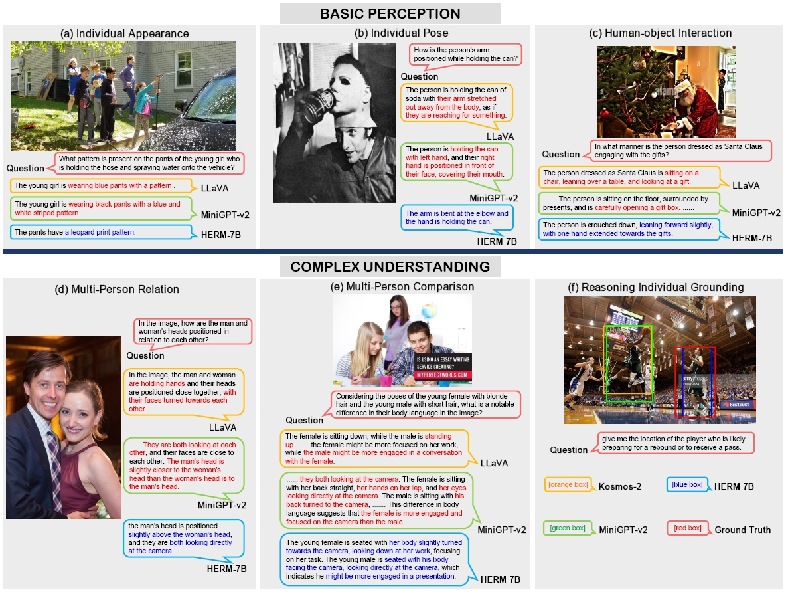

# Human-Centric-MLLM
A Multimodal Large Language Model on human-centric tasks.

## Introduction
By tuning on self-created human-centric annotations, our model can excel in a wide range of human-centric vision-language tasks, greatly surpassing the existing MLLMs on human-centric understanding.

<div align=center>

</div>

## Installation
- Pre-requisites: Python 3.10, CUDA>=11.6 (We used 11.7)
- Install PyTorch 
```sh
pip install torch==2.0.0 torchvision==0.15.1 torchaudio==2.0.1
```
- Install [Flash-attention](https://github.com/Dao-AILab/flash-attention?tab=readme-ov-file#installation-and-features)
- Install the required packages:
```sh
pip install -r requirements.txt
```

## Training

## Inference

## Citation
